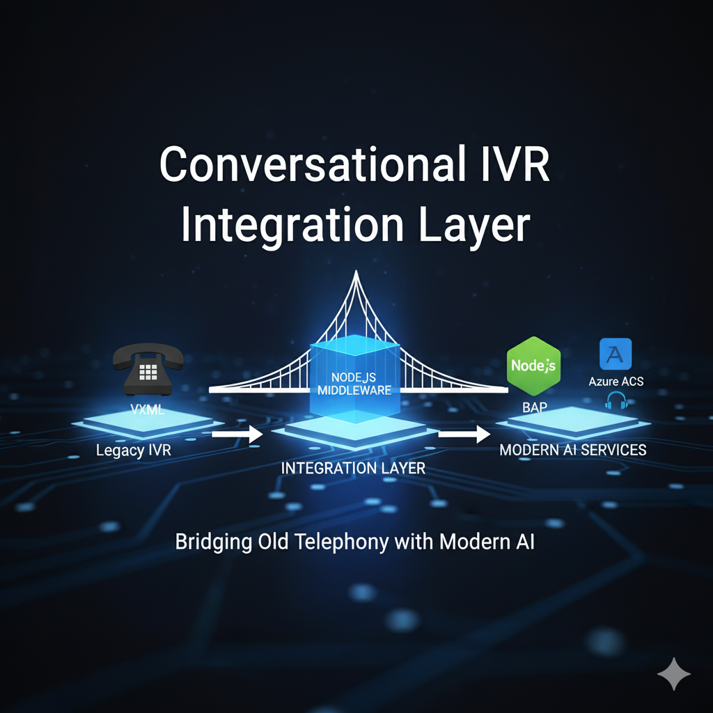
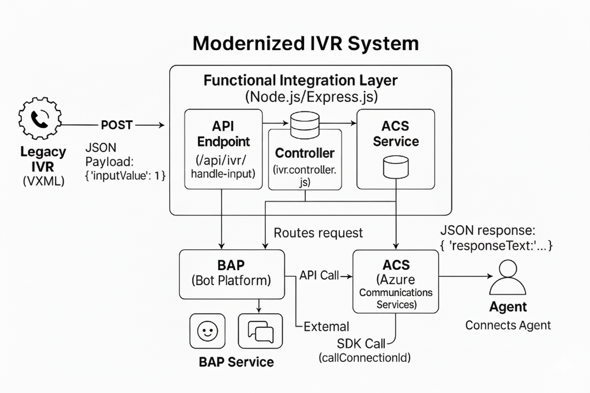
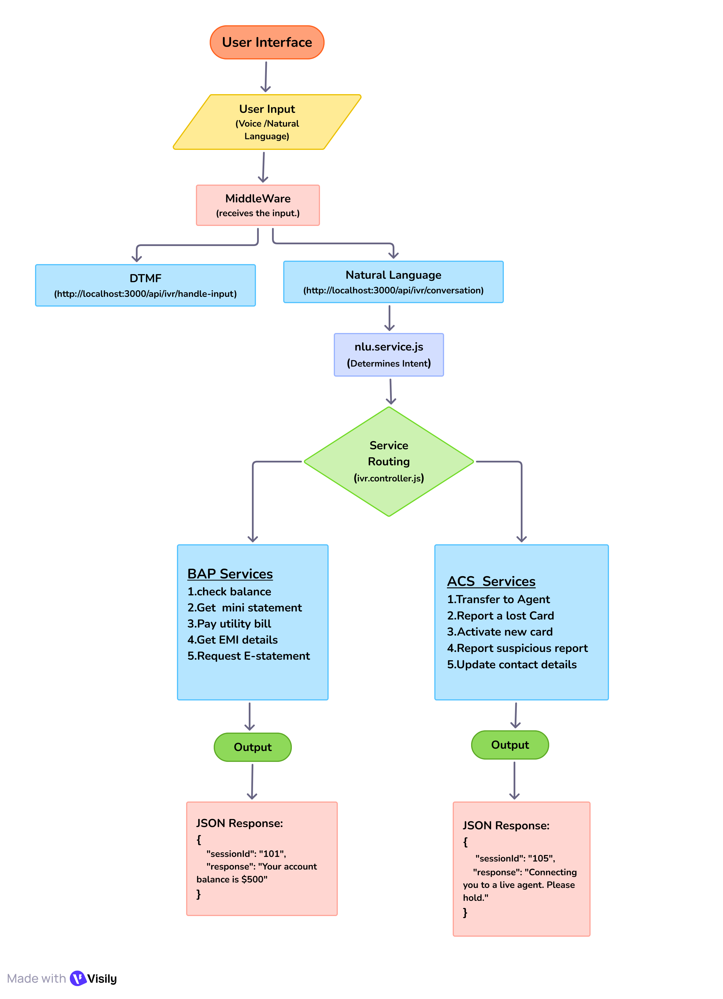

<p align="center">
  
</p>

<h1 align="center">IVR Modernization Middleware - Milestone 2</h1>

<p align="center">
  <strong>Team:</strong> NextGen Voice Solutions<br>
  <strong>Member:</strong> Aravind (Project Lead / Full-Stack Developer)<br>
  <strong>Date:</strong> September 10, 2025
</p>

---

## Introduction

This project modernizes a legacy VXML-based IVR (Interactive Voice Response) system by integrating it with advanced conversational AI platforms like Azure Communication Services (ACS) and Business Automation Platform (BAP).

**Milestone 2** focuses on developing and implementing a robust Node.js middleware. This integration layer routes IVR requests, simulates ACS/BAP integrations, and is structured for future expansion.

---

## System Architecture

The middleware acts as the central hub, decoupling the legacy IVR from backend services.



**Flow Overview:**

- **Legacy IVR** captures user keypress and sends it to **Middleware**
- **Middleware** controller analyzes input, routes to corresponding mock ACS or BAP service
- **Mock Services** simulate responses to user queries
- **Middleware** returns formatted response to IVR

---

## Folder Structure

The project is organized for clarity and modularity:

```
ivr-acs-bap-integration/
├── assets/
│   ├── 1.png                # Success case image (Valid input)
│   ├── 2.png                # (Deprecated, see below)
│   └── 3.png                # Error case image (Client-side failure)
├── docs/
│   ├── API.md               # API documentation
│   └── architecture.png     # System architecture diagram
├── node_modules/
├── src/
│   ├── api/
│   │   ├── controllers/
│   │   │   └── ivr.controller.js      # Core logic for handling IVR requests
│   │   ├── routes/
│   │   │   └── ivr.routes.js          # Defines the API endpoints
│   │   └── services/
│   │       ├── acs.service.js         # Simulates interaction with ACS
│   │       └── bap.service.js         # Simulates interaction with BAP bot
│   ├── config/
│   │   └── index.js                   # For managing environment variables
│   └── utils/
│       └── logger.js                  # For logging requests and errors
├── .env                               # Environment variables (e.g., port, API URLs)
├── .gitignore                         # Files to be ignored by Git
├── package.json
├── README.md                          # Project documentation (this file)
└── server.js                          # Express server entry point
```

---

## Setup and Installation

### Prerequisites

- [Node.js](https://nodejs.org/) (v16 or higher)
- [npm](https://www.npmjs.com/)
- REST client: [Thunder Client](https://www.thunderclient.com/) or Postman

### Installation Steps

1. **Install Dependencies**
   ```bash
   npm install
   ```
2. **Run the Server**
   ```bash
   npm start
   ```
   - Uses `nodemon` for automatic reloading (configured in `package.json`).

---

## API Endpoints

### Main Endpoint

- `POST /api/ivr/handle-input`  
  Receives a user's digit input from the IVR. Routes the request internally to mock ACS or BAP service.

### Mock Endpoints

- `POST /api/mock-bap-bot`  
  Dummy endpoint simulating BAP bot response for self-service queries.

---

## Sample Request/Response

**Request (from IVR to Middleware)**

```json
{
  "sessionId": "session-xyz-12345",
  "inputType": "DTMF",
  "inputValue": "1"
}
```

**Response (from Middleware to IVR)**

```json
{
  "sessionId": "session-xyz-12345",
  "responseText": "Your account balance is $500."
}
```

Endpoints were tested successfully using Thunder Client.

- **Success Case:** Valid input (`inputValue: "1"`)  
  When the user enters a valid input, the middleware navigates to the success page.  
  

- **Error Case:** Client-side failure  
  In case of a client-side error, the middleware navigates to the error page.  
  

---

## Documentation

- **API Reference:** See [`docs/API.md`](./docs/API.md) for complete endpoint details.
- **Architecture:** See [`docs/architecture.png`](./docs/architecture.png) for the system diagram.

---

## Task Division

**As the sole developer for this milestone:**

- **Server & Routing:** Set up Express server and API routes.
- **Controller Logic:** Implemented core request handling and routing.
- **Service Mocking:** Created simulated BAP and ACS services.
- **Documentation:** Authored README.md and API documentation.

---

## Challenges & Learnings

### Challenges

- Structuring Express application for scalability and modularity.
- Simulating asynchronous service calls using async/await to mimic real-world API interactions.

### Learnings

- **Middleware Power:** Middleware can bridge legacy and modern systems, enabling phased modernization.
- **Modular Architecture:** Separation of concerns (routes, controllers, services) leads to clean, maintainable code.

---

## Conclusion

Milestone 2 is complete. The Node.js middleware is fully functional, orchestrating workflows using mocked BAP and ACS services. It robustly handles user inputs and is structured for future integration.

**Next Steps:**  
Transition from mocked services to live ACS and BAP platforms, involving API credentials, SDKs, and real call data.

---

### Conversational AI Integration

This milestone successfully enhances the IVR integration layer by adding support for natural language (speech) inputs, making the system dual-channel.

- **New Conversational Endpoint**: A new endpoint, `/api/ivr/conversation`, was created to specifically handle speech-to-text queries.
- **Natural Language Understanding (NLU)**: A simple, keyword-based NLU service was developed to recognize user intent from plain text.
- **Expanded Service Capability**: All 10 existing services are now accessible via both traditional DTMF (keypress) and the new conversational flow.

---

## 2. Architectural Changes

The core architecture was extended to support a parallel conversational workflow. The integration layer now distinguishes between DTMF and speech inputs, processing the latter through a new NLU module before routing to the backend services.

---

## 3. New & Modified Components

### **New Component: NLU Service**

A new file, `nlu.service.js`, was created to act as the "brain" for understanding user speech.

- **Function**: It takes a text query, converts it to lowercase, and uses `includes()` to search for specific keywords (e.g., "balance", "agent", "statement").
- **Output**: It returns a specific `Intent` string (e.g., `CheckBalance`, `TalkToAgent`) that the controller uses for routing.

### **Modified Components**

- **`ivr.routes.js`**: A new route was added to direct conversational traffic.

  ```javascript
  // Milestone 3 Endpoint for Conversational (speech) inputs
  router.post("/conversation", ivrController.handleConversation);
  ```

- **`ivr.controller.js`**: A new handler function, `handleConversation`, was added. Its job is to:

  1.  Receive the text `query`.
  2.  Call the `nluService` to get the intent.
  3.  Use a `switch` statement to call the appropriate function from the BAP or ACS service based on the recognized intent.

- **`bap.service.js` & `acs.service.js`**: New functions (e.g., `getBalanceFromSpeech`) were added to handle requests originating from the conversational flow and provide natural language responses.

---

## 4. Conversational Workflow Explained

1.  **Speech to Text**: An external system (not part of this project) transcribes the user's spoken words into a text query.
2.  **API Request**: That system sends the text to the new endpoint: `POST /api/ivr/conversation`, with a JSON body like `{ "query": "I want to check my account balance" }`.
3.  **Intent Recognition**: The `handleConversation` function in the controller passes the query to the `nlu.service.js`. The service finds the keyword "balance" and returns the intent `CheckBalance`.
4.  **Service Routing**: The controller's `switch` statement matches the `CheckBalance` intent and calls the `getBalanceFromSpeech()` function in `bap.service.js`.
5.  **Response Generation**: The BAP service returns a JSON object with the appropriate response, e.g., `{ "response": "Your account balance is ₹500." }`.
6.  **Text to Speech**: The middleware sends this response back. The external system would then use a text-to-speech engine to play this message to the user.

### Conversational work flow diagram



## 5. Testing

The new endpoint was tested using Postman to simulate speech-to-text inputs.

### **Test Case: Get Mini Statement**

- **Endpoint**: `POST http://localhost:3000/api/ivr/conversation`
- **Request Body**:
  ```json
  {
    "sessionId": "101",
    "query": "Show me my recent transactions"
  }
  ```
- **Expected Response**:
  ```json
  {
    "sessionId": "101",
    "response": "Your last five transactions are: a debit of $50, a credit of $200, a debit of $25, a debit of $10, and a credit of $500."
  }
  ```
