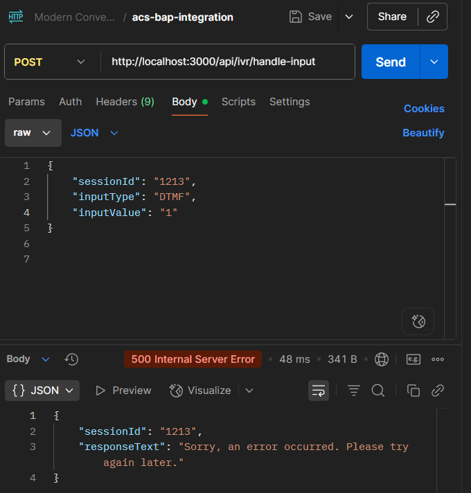

<p align="center">
  
</p>

<h1 align="center">IVR Modernization Middleware - Milestone 2</h1>

<p align="center">
  <strong>Team:</strong> NextGen Voice Solutions<br>
  <strong>Member:</strong> Aravind (Project Lead / Full-Stack Developer)<br>
  <strong>Date:</strong> September 10, 2025
</p>

---

## Introduction

This project modernizes a legacy VXML-based IVR (Interactive Voice Response) system by integrating it with advanced conversational AI platforms like Azure Communication Services (ACS) and Business Automation Platform (BAP).

**Milestone 2** focuses on developing and implementing a robust Node.js middleware. This integration layer routes IVR requests, simulates ACS/BAP integrations, and is structured for future expansion.

---

## System Architecture

The middleware acts as the central hub, decoupling the legacy IVR from backend services.


**Flow Overview:**
- **Legacy IVR** captures user keypress and sends it to **Middleware**
- **Middleware** controller analyzes input, routes to corresponding mock ACS or BAP service
- **Mock Services** simulate responses to user queries
- **Middleware** returns formatted response to IVR

---

## Folder Structure

The project is organized for clarity and modularity:

```
ivr-acs-bap-integration/
├── assets/
│   ├── 1.png                # Success case image (Valid input)
│   ├── 2.png                # (Deprecated, see below)
│   └── 3.png                # Error case image (Client-side failure)
├── docs/
│   ├── API.md               # API documentation
│   └── architecture.png     # System architecture diagram
├── node_modules/
├── src/
│   ├── api/
│   │   ├── controllers/
│   │   │   └── ivr.controller.js      # Core logic for handling IVR requests
│   │   ├── routes/
│   │   │   └── ivr.routes.js          # Defines the API endpoints
│   │   └── services/
│   │       ├── acs.service.js         # Simulates interaction with ACS
│   │       └── bap.service.js         # Simulates interaction with BAP bot
│   ├── config/
│   │   └── index.js                   # For managing environment variables
│   └── utils/
│       └── logger.js                  # For logging requests and errors
├── .env                               # Environment variables (e.g., port, API URLs)
├── .gitignore                         # Files to be ignored by Git
├── package.json
├── README.md                          # Project documentation (this file)
└── server.js                          # Express server entry point
```

---

## Setup and Installation

### Prerequisites

- [Node.js](https://nodejs.org/) (v16 or higher)
- [npm](https://www.npmjs.com/)
- REST client: [Thunder Client](https://www.thunderclient.com/) or Postman

### Installation Steps

1. **Install Dependencies**
    ```bash
    npm install
    ```
2. **Run the Server**
    ```bash
    npm start
    ```
    - Uses `nodemon` for automatic reloading (configured in `package.json`).

---

## API Endpoints

### Main Endpoint

- `POST /api/ivr/handle-input`  
  Receives a user's digit input from the IVR. Routes the request internally to mock ACS or BAP service.

### Mock Endpoints

- `POST /api/mock-bap-bot`  
  Dummy endpoint simulating BAP bot response for self-service queries.

---

## Sample Request/Response

**Request (from IVR to Middleware)**
```json
{
  "sessionId": "session-xyz-12345",
  "inputType": "DTMF",
  "inputValue": "1"
}
```

**Response (from Middleware to IVR)**
```json
{
  "sessionId": "session-xyz-12345",
  "responseText": "Your account balance is $500."
}
```

Endpoints were tested successfully using Thunder Client.

- **Success Case:** Valid input (`inputValue: "1"`)  
  When the user enters a valid input, the middleware navigates to the success page.  
  

- **Error Case:** Client-side failure  
  In case of a client-side error, the middleware navigates to the error page.  
  

---

## Documentation

- **API Reference:** See [`docs/API.md`](./docs/API.md) for complete endpoint details.
- **Architecture:** See [`docs/architecture.png`](./docs/architecture.png) for the system diagram.

---

## Task Division

**As the sole developer for this milestone:**
- **Server & Routing:** Set up Express server and API routes.
- **Controller Logic:** Implemented core request handling and routing.
- **Service Mocking:** Created simulated BAP and ACS services.
- **Documentation:** Authored README.md and API documentation.

---

## Challenges & Learnings

### Challenges
- Structuring Express application for scalability and modularity.
- Simulating asynchronous service calls using async/await to mimic real-world API interactions.

### Learnings
- **Middleware Power:** Middleware can bridge legacy and modern systems, enabling phased modernization.
- **Modular Architecture:** Separation of concerns (routes, controllers, services) leads to clean, maintainable code.

---

## Conclusion

Milestone 2 is complete. The Node.js middleware is fully functional, orchestrating workflows using mocked BAP and ACS services. It robustly handles user inputs and is structured for future integration.

**Next Steps:**  
Transition from mocked services to live ACS and BAP platforms, involving API credentials, SDKs, and real call data.

---
