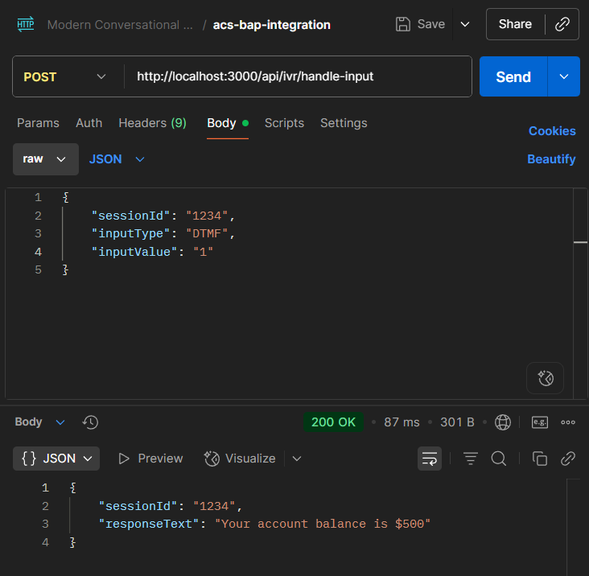
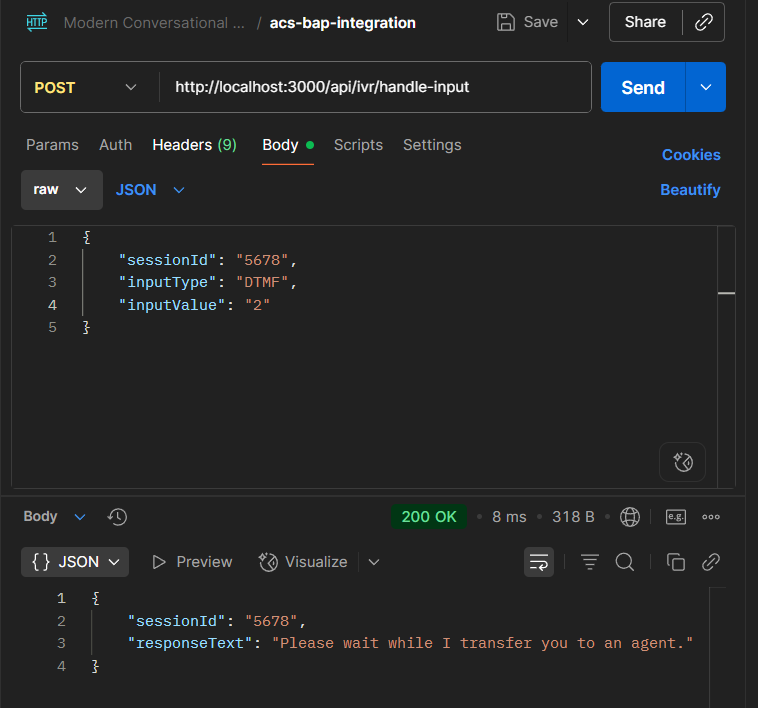
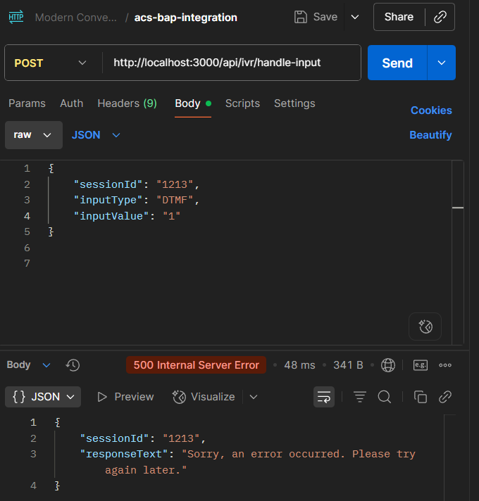
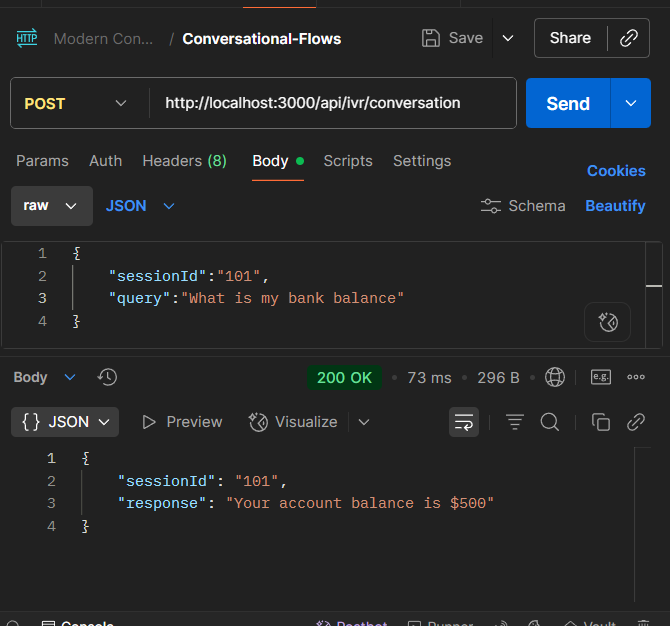
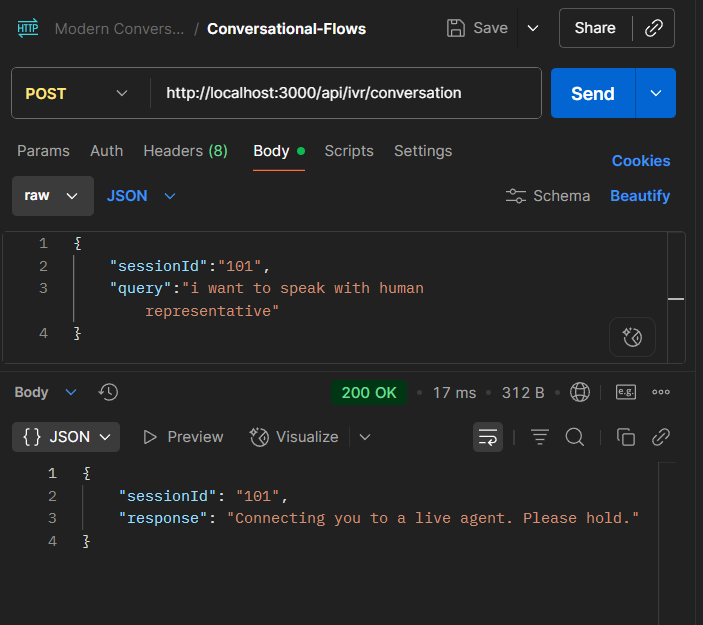
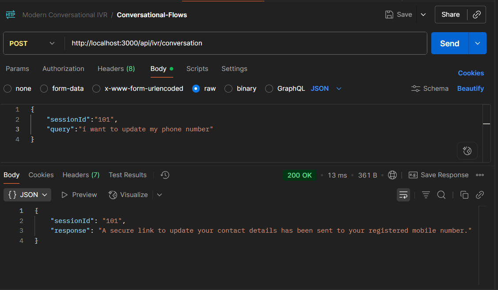
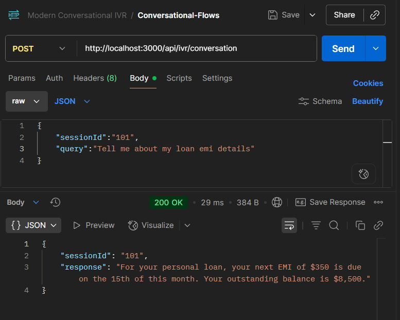

# API Documentation: IVR Integration Layer

This document provides the complete technical reference for the IVR Integration Layer API. The API exposes two primary endpoints: one for legacy DTMF (keypress) inputs and a new one for modern conversational (speech-to-text) inputs.

---

## Key Components

### Bot Application Platform (BAP)

The BAP is the **automated brain** 🤖 of the system. It acts as an intelligent, automated assistant responsible for understanding user requests, processing information, and providing answers for all self-service workflows.

### Azure Communication Services (ACS)

ACS is the **modern telephone operator** 📞. Its primary job is to manage the live phone call itself and handle actions that require leaving the automated system, especially transferring the call to a human agent.

---

## 1. DTMF Endpoint (Milestone 2)

This endpoint handles all requests originating from a user pressing a key on their phone's keypad.

- **URL**: `http://localhost:3000/api/ivr/handle-input`
- **Method**: `POST`
- **Description**: Processes a user's DTMF (keypad) input by routing the request to the correct backend service (BAP for self-service or ACS for live call actions).

---

## 2. Request Specification

The API expects a JSON payload with the following structure.

| Field              |  Type  | Required | Description                                                                |
| ------------------ | :----: | :------: | -------------------------------------------------------------------------- |
| `sessionId`        | String |   Yes    | A unique identifier for the user's entire phone call session.              |
| `inputType`        | String |   Yes    | The method of input. For this project, it must always be `"DTMF"`.         |
| `inputValue`       | String |   Yes    | The number the user pressed on their keypad (e.g., `"1"`, `"10"`).         |
| `callConnectionId` | String |    No    | The unique ID of the live ACS call. **Required only for agent transfers.** |

### Example Request

```json
{
  "sessionId": "session-xyz-12345",
  "inputType": "DTMF",
  "inputValue": "1",
  "callConnectionId": "a1b2c3d4-..."
}
```

---

## 3. Response Specification

The API provides standardized JSON responses for both success and failure scenarios.

### Success Response

Upon successfully processing the request, the API returns a 200 OK status code. The response body contains the text that the legacy IVR system should play back to the user.

- **Status Code:** 200 OK
- **Content-Type:** application/json

#### Example Success Body

```json
{
  "sessionId": "12345",
  "responseText": "Your account balance is $500"
}
```

### Error Response

If a server-side failure occurs, the API returns a 500 Internal Server Error status code with a safe, user-friendly message.

- **Status Code:** 500 Internal Server Error

#### Example Error Body

```json
{
  "sessionId": "session-xyz-12345",
  "responseText": "Sorry, an error occurred. Please try again later."
}
```

---

## 4. Supported inputValue Options

The `inputValue` field determines which workflow is triggered.

| inputValue | Service | Description                                                        |
| :--------: | :-----: | ------------------------------------------------------------------ |
|    "1"     |   BAP   | Checks the user's bank account balance.                            |
|    "2"     |   ACS   | Transfers the user to a live human agent.                          |
|    "3"     |   BAP   | Retrieves the last five transactions (mini statement).             |
|    "4"     |   ACS   | Reports a lost or stolen card and initiates a security workflow.   |
|    "5"     |   ACS   | Begins the process for activating a new debit/credit card.         |
|    "6"     |   BAP   | Starts the utility bill payment process.                           |
|    "7"     |   ACS   | Initiates a workflow to update the user's contact details.         |
|    "8"     |   BAP   | Retrieves details about the user's loan and next EMI payment.      |
|    "9"     |   ACS   | Reports a suspicious transaction for a fraud review.               |
|    "10"    |   BAP   | Requests an e-statement to be sent to the user's registered email. |

---

## 5. Usage Examples

Here are screenshots demonstrating how to test various scenarios using Postman.

### Scenario 1: Balance Inquiry (`inputValue: "1"`)



### Scenario 2: Agent Transfer (`inputValue: "2"`)



### Scenario 3: Error Handling Test



---

## 2. Conversational Endpoint (Milestone 3)

This endpoint handles natural language queries, typically from a speech-to-text engine.

- **URL**: `/http://localhost:3000/api/ivr/conversation`
- **Method**: `POST`

### **Request Body**

| Field       |  Type  | Required | Description                                 |
| ----------- | :----: | :------: | ------------------------------------------- |
| `sessionId` | String |   Yes    | A unique identifier for the user's session. |
| `query`     | String |   Yes    | The transcribed text of the user's speech.  |

### **Supported Conversational Intents**

| Intent                        | Keywords                                 | Service |
| ----------------------------- | ---------------------------------------- | :-----: |
| `CheckBalance`                | "balance"                                |   BAP   |
| `TalkToAgent`                 | "agent", "human", "representative"       |   ACS   |
| `RequestEStatement`           | "email statement", "e-statement"         |   BAP   |
| `GetMiniStatement`            | "statement", "transactions"              |   BAP   |
| `ReportLostCard`              | "lost my card", "stolen card"            |   ACS   |
| `ActivateNewCard`             | "activate" and "card"                    |   ACS   |
| `PayUtilityBill`              | "pay", "bill", "utility", "recharge"     |   BAP   |
| `UpdateContactDetails`        | "update", "contact", "address", "number" |   ACS   |
| `GetLoanDetails`              | "loan", "emi"                            |   BAP   |
| `ReportSuspiciousTransaction` | "suspicious", "fraud", "unauthorized"    |   ACS   |

---

## 3. Responses

The API provides standardized JSON responses for both success and failure scenarios.

### **Example Success Response**

```json
{
    "sessionId": "conv-session-456",
    "response": "Your account balance is ₹500."
}
Example "Unknown Intent" Response
JSON

{
    "sessionId": "conv-session-789",
    "response": "Sorry, I didn't understand that. Can you please rephrase?"
}
4. Usage Examples (Postman Screenshots)
Here are screenshots demonstrating how to test various scenarios.

Test Case 1: Check Balance


Test Case 2: Talk to Agent


Test Case 7: Update Contact Details


Test Case 8: Get Loan Details

```
